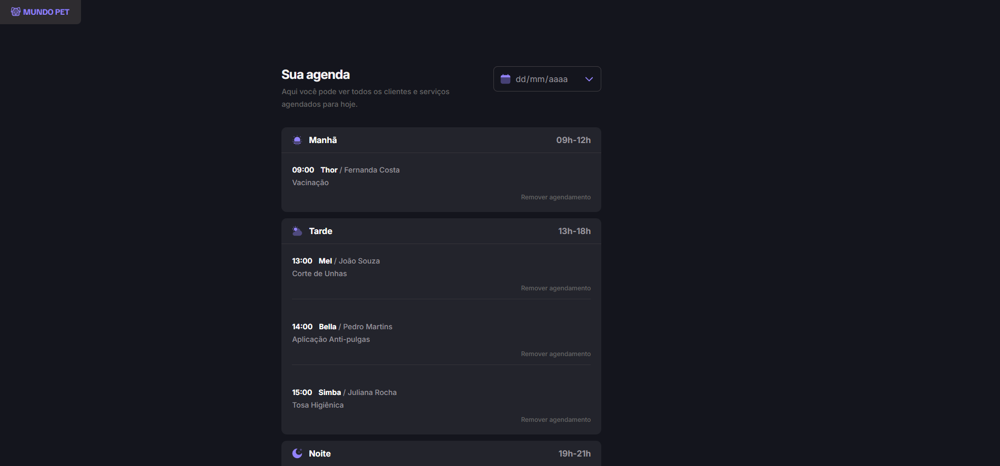

<h1 align="center"> 🐕 Mundo Pet 🐈</h1>

Projeto pessoal utilizando conceitos HTML, CSS e Javascript.

  <a href="#-tecnologias">Tecnologias</a>&nbsp;&nbsp;&nbsp;|&nbsp;&nbsp;&nbsp;
  <a href="#-projeto">Projeto</a>&nbsp;&nbsp;&nbsp;|&nbsp;&nbsp;&nbsp;
  <a href="#-layout">Layout</a>&nbsp;&nbsp;&nbsp;

 

  

## 🚀 Tecnologias

Esse projeto foi desenvolvido com as seguintes tecnologias:

-   HTML e CSS
-   Javascript
-   Git e GitHub
-   Figma

## 💻 Projeto

Mundo Pet é uma agenda de serviços para tratamento de animais domésticos, o usuário poderá gerenciar a agenda com a criação de um serviço com horário disponível. Clique<a href="https://mundo-pet-six.vercel.app/" target="_blank" rel="noopener noreferrer"> aqui</a> para testar a página.

## 🎨 Layout

Clique <a href="https://www.figma.com/file/HCc1hoadm7zd038oiL51xE?node-id=3128-684&t=UqUYf6rlrN1xklOq-0&type=design&mode=design">aqui</a> para conhecer a prototipagem do projeto.
 
 
 
 

Desenvolvido com ♥ by Mateus de Castro Macedo 👨‍💻

